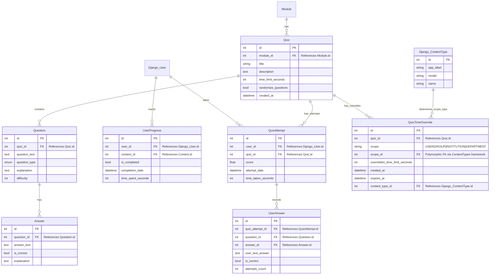

# Enhanced LearnMore: AI-Powered Learning Platform
Design Document for INFS3202/7202 Web Information Systems

Submitted by: Nissan Dookeran  
Student ID: 45121586

## Table of Contents
1. [Project Overview and Key Features](#project-overview-and-key-features)
2. [Database Design](#database-design)
3. [UI/UX Design HTML Mockups](#uiux-design-html-mockups)
4. [Technology Research](#technology-research)
5. [Accessibility](#accessibility)
6. [Timeline](#timeline)
7. [References](#references)

## Document Purpose

This design document presents a comprehensive plan for the development of Enhanced LearnMore, a Software as a Service (SaaS) platform that revolutionizes online learning by combining structured course content with AI-powered tutoring. The document covers all aspects of the project from conceptual design to implementation timeline.

The Enhanced LearnMore platform addresses the requirements specified in the INFS3202/7202 Web Information Systems course project, specifically focusing on the LearnMore project option. This platform enables educators, trainers, and companies to create multipage courses, generate QR codes for easy sharing, and track learner progress, while adding innovative AI tutoring capabilities.

This document serves as a blueprint for the implementation phase and demonstrates how the project will meet both the core functionality requirements and the enhanced features specified in the assessment criteria.

Each section of this document addresses specific aspects of the design and development process, providing detailed information on how the platform will be implemented, what technologies will be utilized, and how the system will operate to deliver a comprehensive learning experience.

# Project Overview and Key Features
## Executive Summary
Enhanced LearnMore is an AI-powered educational SaaS platform designed to transform traditional e-learning by integrating personalized tutoring, adaptive assessments, and seamless content distribution via QR codes. The platform supports course creators and institutions in building structured, multi-page courses with rich content and accessibility features. Key innovations include a retrieval-augmented AI tutor, institutional single sign-on (SSO) integration, detailed learner analytics, and a modular content editor. This document outlines the system’s architecture, database schema, UI/UX mockups, accessibility considerations, technology decisions, and a phased implementation timeline. Enhanced LearnMore delivers a scalable, inclusive, and intelligent learning experience, aligning with the Web Information Systems project specifications and extending them with robust enhancements.
Enhanced LearnMore is a Software as a Service (SaaS) platform that revolutionizes online learning by combining structured course content with AI-powered tutoring. The platform addresses several critical challenges faced by both learners and educators in traditional online learning environments.

## User Challenges and Solutions

| User Challenge | Enhanced LearnMore Solution |
|----------------|---------------------------|
| **Information overload** causing learner overwhelm and abandonment | AI tutor provides personalized guidance and focuses learning on most relevant content |
| **One-size-fits-all courses** failing to address individual knowledge gaps | Personalized topic linking and adaptive assessments tailor the learning experience to individual needs |
| **Limited access to educational resources** for geographically dispersed learners | QR code generation enables easy sharing and access to digital content in physical environments |
| **Poor retention and comprehension** of complex concepts | RAG-enhanced AI tutor explains concepts using learner's specific context and prior knowledge |
| **Siloed institutional learning systems** creating barriers between organizations | Institutional integration features enable cross-organizational learning while maintaining access controls |
| **Lack of engagement** leading to incomplete courses | Gamification elements and progress tracking maintain motivation throughout the learning journey |
| **Difficulty distributing course materials** in classroom or training settings | Printable QR code sheets provide instant digital access to physical attendees |

## User Scenarios

### Scenario 1: The Self-Directed Learner
**User:** Maria, a working professional wanting to upskill in data science
- **Challenge:** Limited time, varied background knowledge, needs targeted learning
- **Experience with Enhanced LearnMore:**
  1. Maria enrolls in a data science course and completes an initial assessment
  2. The platform identifies knowledge gaps in statistics and recommends specific modules
  3. When struggling with regression analysis, Maria activates the AI tutor
  4. The tutor references her previous work experience to explain concepts in familiar terms
  5. Maria creates personalized topic links connecting regression concepts to practical applications
  6. She earns badges for completing challenging sections, maintaining her motivation
  7. Maria uses the mobile version during her commute, seamlessly continuing her progress

### Scenario 2: The Educator
**User:** Professor Chen, teaching both in-person and online statistics courses
- **Challenge:** Diverse student needs, limited time for individual attention
- **Experience with Enhanced LearnMore:**
  1. Professor Chen creates a comprehensive statistics course with varied content types
  2. He generates and prints QR codes linking to specific modules for in-class distribution
  3. For complex concepts, he embeds AI tutor checkpoints with specialized knowledge
  4. He reviews analytics showing which concepts students struggle with most
  5. Using this data, he refines content and creates additional explanatory materials
  6. For institutional students, he enables SSO access through their university credentials
  7. He tracks class progress through the analytics dashboard and identifies at-risk students

### Scenario 3: The Institutional Administrator
**User:** Sarah, learning technology administrator at a large corporation
- **Challenge:** Managing training across departments, ensuring compliance, measuring outcomes
- **Experience with Enhanced LearnMore:**
  1. Sarah sets up corporate SSO integration and imports employee hierarchies
  2. She designates required courses for different departments with completion deadlines
  3. Department managers receive automated progress reports on their teams
  4. Content from existing corporate training is seamlessly imported and enhanced
  5. Usage analytics help identify the most effective learning materials
  6. AI tutoring interactions are anonymized and analyzed to improve content
  7. QR codes on physical training materials connect in-person and digital learning experiences

## Target Audience
- **Primary Users**: Self-directed learners looking for personalized educational experiences
- **Secondary Users**: Course creators (educators, trainers, companies) who want to create interactive and adaptive learning materials
- **Tertiary Users**: Course administrators who manage multiple courses and creators
- **Institutional Users**: Educational organizations that want to provide structured learning experiences for their members

## Key Features

### Course Creation and Management
- Multipage course creation with intuitive navigation
- Support for diverse content types (text, images, videos, web content)
- Content organization by courses, modules, and topics
- Difficulty level assignment (100-700 scale)
- Prerequisites management (required vs. recommended)
- Institutional course branding and access controls

### QR Code Generation and Sharing
- Automatic QR code generation for each course, module, and content page
- One-click sharing of QR codes for easy distribution to learners
- Printable QR code sheets for physical distribution
- Customized landing pages for each QR code access point
- QR code analytics to track usage and engagement

### AI-Powered Tutoring System
- Interactive chat interface with LLM tutor
- Personalized learning focus based on user preferences
- Ability to reference specific course content during tutoring
- Support for both local LLMs (via Ollama) and cloud-based options (via API keys)
- Option to save important conversations for future reference

### Content Management and RAG Integration
- Extraction and indexing of content from uploaded materials
- RAG-style embedding storage for enhanced AI tutoring capabilities
- Content attribution and source management
- Version control for course materials

### Assessment and Progress Tracking
- Multiple-choice quiz generation based on course content
- Adaptive assessment with explanations and retry opportunities
- Progress tracking across courses, modules, and topics
- Mastery-based learning pathways
- Analytics for both learners and course creators
- Institutional performance dashboards

### Personalized Learning Experience
- Custom topic linking across different courses and modules
- Difficulty adjustment based on learner progress
- Visual indicators of topic mastery
- Notifications for new content and learning reminders

### Institutional Integration
- Single Sign-On (SSO) for institutional members
- Role-based access control (student, faculty, staff, admin)
- Course access management by institution
- Institutional branding on courses
- Access request workflow for restricted content
- Analytics and reporting for institutional administrators

### Collaboration and Sharing
- QR code generation for courses, modules, and tutor interfaces
- Collaborative content board for sharing approved materials
- Content popularity tracking and creator recognition
- Attribution and citation management for shared content
- Institutional content filtering

### Gamification Elements
- Completion badges for achievements
- Leaderboards for course completion
- Progress visualization and rewards

# Database Design

This document outlines the comprehensive database schema for the Enhanced LearnMore platform, a multi-tenant SaaS application designed for educational institutions and content creators. The design leverages Django's built-in functionality while extending it with custom models to support specialized features.

## Core Architecture Components

1. **Multi-tenant SaaS Architecture**
2. **Institution & User Management**
3. **Course Content Management**
4. **Assessment & Progress Tracking**
5. **QR Code & Sharing System**
6. **RAG & AI Tutor Implementation**
7. **Personalization & Collaboration**
8. **Gamification Features**

## Django Built-in Models Integration

The system leverages Django's robust built-in models for authentication, permissions, and content management:

| Django Model | Usage in Our System | Documentation Link |
|--------------|---------------------|--------------------|
| `auth.User` | Base authentication and user management | [User Model Docs](https://docs.djangoproject.com/en/stable/ref/contrib/auth/#user-model) |
| `auth.Group` | Permission groups for institutional roles | [Group Model Docs](https://docs.djangoproject.com/en/stable/ref/contrib/auth/#group-model) |
| `auth.Permission` | Fine-grained access controls for courses and content | [Permission Docs](https://docs.djangoproject.com/en/stable/ref/contrib/auth/#permissions) |
| `admin.LogEntry` | Administrative audit trail for course management | [Admin Log Docs](https://docs.djangoproject.com/en/stable/ref/contrib/admin/#logentry-model) |
| `sessions.Session` | Learning session management and tracking | [Session Docs](https://docs.djangoproject.com/en/stable/topics/http/sessions/) |
| `contenttypes.ContentType` | Polymorphic relationships for ContentAccessPolicy and QuizTimeOverride | [ContentTypes Docs](https://docs.djangoproject.com/en/stable/ref/contrib/contenttypes/) |

## Database Design Decisions and Rationale

| Design Decision | Rationale | Alternative Considered |
|-----------------|-----------|------------------------|
| **Content Blocks for modular content** | • Supports complex content editing and modular management<br>• Enables rich content experiences<br>• Aligns with block-based editor in UI mockups | Single-content records were simpler but lacked flexibility for complex layouts |
| **QR Print Configurations** | • Enables reusable, customized QR code sheets<br>• Matches QR code management interface<br>• Improves user efficiency | One-time configurations would lack the reusability shown in mockups |
| **Quiz Timer Overrides** | • Ensures accessibility and institutional flexibility<br>• Supports accommodations for diverse learners<br>• Aligns with accessibility features in mockups | Static quiz timing would be simpler but insufficient for accessibility needs |
| **Board Interaction Analytics** | • Provides richer collaboration insights<br>• Enables detailed analytics visualizations<br>• Supports engagement metrics | Simple view tracking would be inadequate for the analytics shown in mockups |
| **Subscription tied to institution or individual** | • Supports both B2B and B2C business models<br>• Allows transition from individual to institutional accounts<br>• Flexible pricing structure | Separate models for individual/institutional would be clearer but create duplication |
| **Department sub-structure** | • Reflects real-world organizational structures<br>• Enables delegated administration<br>• Supports course organization by department | Flatter structure would be simpler but limit institutional use cases |
| **Course sharing between institutions** | • Enables collaborative education scenarios<br>• Supports educational partnerships<br>• Creates network effects and content marketplace potential | Strict tenant isolation would be more secure but limit collaboration value |
| **LLM interaction logging** | • Comprehensive storage of user-LLM conversations<br>• Supports tutor improvement and analytics<br>• Enables personalization based on conversation history | Minimal logging would reduce storage needs but limit AI tutor effectiveness shown in mockups |

## Schema Components

### 1. Institution & User Management


### 2. SaaS Subscription Management


### 3. Course Content Management

#### 3.1 Course and Institutional Access


#### 3.2 Module and Content Structure


### 4. Assessment and Progress Tracking



### 5. QR Code Management


### 6. Personalization and Collaboration

#### 6.1 Personal Learning Experience


#### 6.2 Collaborative Learning Tools


### 7. Gamification and Enrollment


## Table Structure with Key Relationships

The following table provides a comprehensive listing of all database tables with their primary and foreign key relationships, noting which components leverage Django's built-in functionality:

| Table | Primary Key | Foreign Keys | Description |
|-------|------------|--------------|-------------|
| **Django User** | id | - | Django's built-in User model handles authentication, permissions, and basic user information |
| **Django Group** | id | - | Django's built-in Groups for permission management |
| **Django Permission** | id | content_type_id → Django ContentType.id | Django's built-in Permissions system |
| **Django Admin Log** | id | user_id → Django User.id<br>content_type_id → Django ContentType.id | Django's built-in admin action logging |
| **Django Session** | session_key | - | Django's built-in session management |
| **Django Content Type** | id | - | Django's built-in content type framework |
| **UserProfile** | id | user_id → Django User.id | Extended user profile information |
| **Institution** | id | subscription_id → Subscription.id<br>owner_user_id → Django User.id | Educational or organizational institutions for SSO and access control |
| **InstitutionalMembership** | id | user_id → Django User.id<br>institution_id → Institution.id | Links users to their institutional affiliations with roles |
| **InstitutionalDepartment** | id | institution_id → Institution.id<br>head_user_id → Django User.id | Departments within an institution |
| **DepartmentMembership** | (user_id, department_id) | user_id → Django User.id<br>department_id → InstitutionalDepartment.id | Links users to departments |
| **InstitutionalCourseAccess** | id | course_id → Course.id<br>institution_id → Institution.id | Controls which institutions have access to which courses |
| **AccessRequest** | id | user_id → Django User.id<br>course_id → Course.id<br>processed_by_id → Django User.id | Handles access requests for restricted courses |
| **Course** | id | creator_id → Django User.id<br>institution_id → Institution.id<br>department_id → InstitutionalDepartment.id | Educational courses created by users |
| **CourseSharing** | id | course_id → Course.id<br>source_institution_id → Institution.id<br>target_institution_id → Institution.id | Manages course sharing between institutions |
| **Module** | id | course_id → Course.id | Organizational units within courses |
| **Content** | id | module_id → Module.id | Individual content items (text, videos, etc.) |
| **ContentBlock** | id | content_id → Content.id | Modular blocks that make up content (text, image, video, etc.) |
| **ContentAccessPolicy** | id | content_id → Content.id<br>content_type_id → Django ContentType.id | Controls access to specific content items |
| **ContentEmbedding** | id | content_id → Content.id | Vector embeddings of content chunks for RAG |
| **ContentAttribution** | id | content_id → Content.id | Source attribution for content items |
| **SubscriptionPlan** | id | - | Available subscription tiers with features and pricing |
| **Subscription** | id | plan_id → SubscriptionPlan.id | Active subscriptions with status and billing info |
| **FeatureFlag** | id | - | Features that can be enabled/disabled per subscription |
| **SubscriptionFeature** | (subscription_id, feature_id) | subscription_id → Subscription.id<br>feature_id → FeatureFlag.id | Features enabled for specific subscriptions |
| **UsageMetrics** | id | institution_id → Institution.id<br>subscription_id → Subscription.id | Usage tracking for billing and analytics |
| **BillingRecord** | id | subscription_id → Subscription.id | Billing history for subscriptions |
| **QRPrintConfiguration** | id | user_id → Django User.id<br>course_id → Course.id | Saved configurations for QR code printing |
| **Tag** | id | - | Categories for organizing courses |
| **CourseTag** | (course_id, tag_id) | course_id → Course.id<br>tag_id → Tag.id | Many-to-many relationship between courses and tags |
| **Prerequisite** | (course_id, prerequisite_id) | course_id → Course.id<br>prerequisite_id → Course.id | Prerequisites between courses |
| **Quiz** | id | module_id → Module.id | Assessment quizzes for modules |
| **QuizTimeOverride** | id | quiz_id → Quiz.id<br>content_type_id → Django ContentType.id | Time limit overrides for accessibility accommodations |
| **Question** | id | quiz_id → Quiz.id | Individual assessment questions |
| **Answer** | id | question_id → Question.id | Answer options for questions |
| **UserProgress** | id | user_id → Django User.id<br>content_id → Content.id | Tracks user progress through content |
| **QuizAttempt** | id | user_id → Django User.id<br>quiz_id → Quiz.id | Records of user attempts at quizzes |
| **UserAnswer** | id | quiz_attempt_id → QuizAttempt.id<br>question_id → Question.id<br>answer_id → Answer.id | User's answers to questions |
| **PersonalTopicLink** | id | user_id → Django User.id | User-created links between topics |
| **TopicLinkContent** | (topic_link_id, content_id) | topic_link_id → PersonalTopicLink.id<br>content_id → Content.id | Links personal topics to content |
| **CollaborativeBoard** | id | creator_id → Django User.id | Shared content boards |
| **BoardContent** | (board_id, content_id) | board_id → CollaborativeBoard.id<br>content_id → Content.id | Content shared on boards |
| **BoardInteraction** | id | board_id → CollaborativeBoard.id<br>user_id → Django User.id | User interactions with collaborative boards |
| **Notification** | id | user_id → Django User.id | User notifications |
| **Badge** | id | - | Achievement badges for gamification |
| **UserBadge** | (user_id, badge_id) | user_id → Django User.id<br>badge_id → Badge.id | Badges earned by users |
| **Enrollment** | (user_id, course_id) | user_id → Django User.id<br>course_id → Course.id | User enrollment in courses |
| **LLMInteraction** | id | user_id → Django User.id<br>content_id → Content.id | Records of user interactions with AI tutor |

## Django Model Integration Map

| Feature Area | Django Integration | Custom Models | Integration Pattern |
|--------------|-------------------|--------------|---------------------|
| **Authentication** | User Model | UserProfile | 1:1 extension of Django User model with additional user metadata |
| **Authorization** | Group, Permission | InstitutionalMembership, ContentAccessPolicy | Custom roles layered on Django's permission system with institution scope |
| **Generic Relations** | ContentType | ContentAccessPolicy, QuizTimeOverride | Uses Django's ContentType for polymorphic relationships to different entity types |
| **Admin Management** | Admin LogEntry | CourseSharing, AccessRequest | Extends Django's admin logging with custom audit trails for institutional actions |
| **Session Management** | Session | UserProgress, LLMInteraction | Associates learning activities with Django sessions for comprehensive tracking |
| **Form Processing** | Form | QRPrintConfiguration | Leverages Django's form validation and processing for complex UI interactions |
| **Multi-tenancy** | Sites | Institution, Course | Extends Django's multi-site capabilities with institution-based content separation |
| **Query Optimization** | QuerySet, Manager | Custom model managers | Custom querysets for complex institution-based filtering and content access control |

This mapping shows how our custom database schema builds upon and extends Django's built-in functionality to create a robust educational platform with advanced multi-tenant features.

## Django Integration Diagram


The diagram above illustrates how our custom tables integrate with Django's built-in models, providing a comprehensive view of these critical relationships.

# UI/UX Design HTML Mockups (Built with Bootstrap, Live Screenshots Included)

The following user interface mockups are fully implemented using HTML and Bootstrap CSS, and represent live-rendered views from the Enhanced LearnMore prototype. All screenshots included below are taken directly from functioning HTML pages built with responsive, mobile-first design principles, ensuring accessibility and usability across desktop, tablet, and mobile devices. These mockups form the basis for the final frontend implementation.

## User Interface Components

The Enhanced LearnMore platform requires a comprehensive set of user interfaces to support its core functionality. Based on stakeholder requirements and analysis of user workflows, we've identified the following key interface components:

### Core Platform Interfaces
- **Landing Page & Authentication**: A modern, responsive entry point with clear value proposition and secure authentication mechanisms
- **User Dashboard**: Personalized view of enrolled courses, learning progress, and institutional resources
- **Administrative Console**: Complete management of SaaS subscriptions, user permissions, and organization settings

### Course Management
- **Course Creator Studio**: Intuitive DRAP (Design, Review, Approve, Publish) workflow for course authors
- **Module & Content Editor**: Block-based content editor supporting rich media, assessments, and interactive elements
- **Publishing Controls**: Version management, access settings, and institutional sharing options

### Learning Distribution Tools
- **QR Code Generator**: Custom QR code creation with configuration options for distribution and tracking
- **Print Layout Designer**: Templated layouts for printed materials featuring QR links to digital content
- **Sharing Analytics**: Detailed metrics on QR code usage and content access patterns

### Analytics & Assessment
- **Learner Progress Tracking**: Comprehensive views of individual and cohort progress through course materials
- **Assessment Builder**: Tools for creating quizzes, assignments, and interactive assessments
- **Reporting Dashboard**: Analytics visualizations for instructors and institutional administrators

These interface components are being implemented with responsive design principles to ensure accessibility across devices, and with careful attention to user experience based on feedback from our pilot implementation partners.

## Mockup List and Descriptions

### 1. Home Page
- Landing page with key features and introduction
- Platform highlights and benefits
- Call-to-action for registration
- Testimonials and sample courses

**Example LLM Prompt for Generation:**
```
Generate an HTML and CSS mockup for a landing page of an educational platform called "Enhanced LearnMore" using Bootstrap CSS framework. 

Include the following sections:
1. A modern hero section with a compelling headline about revolutionizing online learning with AI and a clear call-to-action button
2. Key benefits section with 3-4 key features (focus on course creation, QR code sharing, and AI tutoring)
3. How it works section showing the platform workflow
4. Testimonials from educators and learners
5. Sample course showcase with visual cards
6. Simple footer with links

Make the design responsive for desktop, tablet and mobile screens. Use a clean, education-focused color scheme with blue as primary color.
```
#### Screenshots of Final Home Page Mockup 

The following screenshots demonstrate the responsive design and key sections of the landing page mockup (`index.html`):


*Hero section with compelling headline and call-to-action*


*Key features highlighting AI tutoring, course creation, and QR sharing capabilities*


*Social proof section with user testimonials and course showcase*

The mockup implements a modern, education-focused design using Bootstrap's responsive grid system and components. The blue-based color scheme maintains consistency with the platform's branding while ensuring good contrast and readability across all screen sizes.

### 2. Authentication Pages
#### 2.1 Registration Page
- User signup with email/password
- Institutional affiliation selection
- Role selection (learner/course creator)

**Example LLM Prompt for Generation:**
```
Create an HTML and CSS mockup for a registration page for "Enhanced LearnMore" educational platform using Bootstrap CSS.

Include the following elements:
1. Clean form layout with input fields for:
   - Full name
   - Email address
   - Password (with strength indicator)
   - Password confirmation
2. Role selection radio buttons (Learner, Educator, Institution Admin)
3. Institutional affiliation section with:
   - Dropdown for selecting known institutions 
   - Option to enter custom institution
   - Email domain verification note
4. Checkbox for terms and conditions
5. Clear registration button
6. Social registration options (Google, GitHub)
7. Link to login page for existing users

Make the design responsive for desktop, tablet and mobile screens. Use consistent branding with the main site (blue primary color).
```
##### Screenshots of Final Registration Page Mockup 

The following screenshots demonstrate the responsive design for the registration page (`register.html`):


*Registration form with role selection, institution affiliation, and password strength validation*


#### 2.2 Login Page
- Standard login form
- Institutional SSO login options
- Password recovery link

**Example LLM Prompt for Generation:**
```
Generate an HTML and CSS mockup for a login page for "Enhanced LearnMore" educational platform using Bootstrap CSS.

Include:
1. Clean, centered login form with:
   - Email/username field
   - Password field with show/hide toggle
   - Remember me checkbox
   - Login button
2. Social login options (Google, GitHub)
3. Institutional SSO login button with tooltip explaining it's for users with institutional accounts
4. "Forgot password" link
5. Link to registration page for new users
6. Brief product branding/description

Make the design responsive for desktop, tablet and mobile views. Use the platform's blue-based color scheme.
```

##### Screenshot of Final Login Page Mockup 

The following screenshots demonstrate the responsive design for the login page (`login.html`):


*Login form with social login options, institutional SSO, and password recovery*

### 3. Dashboard
- Overview of enrolled courses (for learners) or created courses (for educators)
- Progress visualization
- Recent activity feed
- Continue learning section
- Recommended courses (with institutional highlighting)
- Notification area

**Example LLM Prompt for Generation:**
```
Create an HTML and CSS mockup for a user dashboard for the "Enhanced LearnMore" educational platform using Bootstrap CSS.

The dashboard should have:
1. Header with logo, search bar, notifications bell, and user profile dropdown
2. Sidebar navigation with: Dashboard, My Courses, Explore, AI Tutor, Settings
3. Main content area with:
   - Welcome message with user name and current progress summary
   - Visual progress chart/ring showing overall completion percentage
   - "Continue Learning" section with the most recent 2-3 courses and progress bars
   - Activity timeline showing recent actions (completed modules, quiz results, etc.)
   - Recommended courses section with 3-4 course cards

Include responsive designs for desktop, tablet and mobile views. On mobile, the sidebar should collapse to a hamburger menu. Use blue as primary color with appropriate accents.
```

#### Screenshots of Final Learner's Dashboard Page Mockup 

The following screenshots demonstrate the responsive design for the dashboard (`dashboard.html`):


*Dashboard showing enrolled courses, progress visualization, and activity feed*

 
*Recent activity timeline and a recommended courses section*

### 4. Course Catalog
- Filterable course grid with difficulty indicators
- Search functionality with tag filtering
- Course cards with completion estimation
- Institutional course highlighting
- Enrollment options with institutional access indicators

**Example LLM Prompt for Generation:**
```
Design an HTML and CSS mockup for a course catalog page for "Enhanced LearnMore" educational platform using Bootstrap CSS.

Include these elements:
1. Header with navigation and user account controls
2. Left sidebar with filtering options:
   - Categories/topics with checkboxes
   - Difficulty level range slider (100-700 scale)
   - Institution filters (if applicable)
   - Duration filters
   - Tag selection area
3. Main content area with:
   - Search bar with advanced search toggle
   - Sort options (newest, most popular, etc.)
   - Grid of course cards (6-8 cards) showing:
     - Course thumbnail
     - Title and brief description
     - Instructor name
     - Difficulty indicator (visual scale)
     - Estimated completion time
     - Institution badge (if applicable)
     - Enrollment/details button
4. Pagination controls

Make the design responsive, with the filter sidebar collapsing on mobile. Use the platform's blue-based color scheme and ensure accessibility with clear contrast and indicators.
```

#### Screenshots of Final Course Catalog Page Mockup 

The following screenshot demonstrates the course catalog interface (`course-catalog.html`):


*Course catalog showing search filters, course grid, and filtering options*


### 5. Course Creation Interface
- Form for creating new course
- Fields for title, description, difficulty level
- Module addition interface
- Settings for prerequisites and access controls

**Example LLM Prompt for Generation:**
```
Create an HTML and CSS mockup for a course creation interface for "Enhanced LearnMore" educational platform using Bootstrap CSS.

The interface should include:
1. Header with platform navigation and creator dashboard links
2. Multi-step form layout with progress indicators:
   - Step 1: Basic Information
     * Course title field
     * Description textarea with rich text editor controls
     * Difficulty level selector (100-700 scale with descriptions)
     * Category/topic selection (multi-select)
     * Estimated completion time
   - Step 2: Course Structure
     * Module creation interface (add/remove/reorder)
     * For each module: title, description, estimated duration
     * Button to add initial content to modules
   - Step 3: Access Settings
     * Visibility options (public, restricted, institutional)
     * Prerequisites selection (searchable course list)
     * Access code option (if restricted)
     * Institutional access controls
3. Save as draft and publish buttons
4. Preview option

Make the interface responsive for desktop, tablet and mobile views. Use consistent branding with the main platform.
```
#### Screenshots of Final Course Creation Page Mockup 

The following screenshots demonstrate the course creation interface steps (`course-creator.html`):


*Step 1: Basic course information including title, description, difficulty and categories*


*Step 2: Course structure with module creation and content organization*


*Step 3: Access settings and publishing options*


### 6. Course Content Editor
- Rich text editor for content creation
- Media embedding tools
- Content block management
- Save and preview options

**Example LLM Prompt for Generation:**
```
Design an HTML and CSS mockup for a course content editor page for "Enhanced LearnMore" educational platform using Bootstrap CSS.

The editor interface should include:
1. Header with course navigation breadcrumbs and save controls
2. Left sidebar with:
   - Module/page navigation tree
   - Content block type selector (text, image, video, quiz, etc.)
   - Settings panel
3. Main editor area with:
   - Rich text editor with formatting toolbar
   - Block-based content approach
   - Example blocks showing:
     * Text content with formatting
     * Embedded image with caption
     * Video embedding
     * Code snippet with syntax highlighting
     * Quiz/assessment component
   - Block reordering handles
4. Right sidebar (collapsible) with:
   - Block settings/properties
   - AI assistance panel for content suggestions
   - Content accessibility checker
5. Footer with save, preview, and publish options

Make the design responsive, with appropriate adaptations for tablet and mobile. Use the platform's blue-based color scheme with clear visual hierarchy.
```
#### Screenshots of Final Course Editor Page Mockup 

The following screenshots demonstrate the course content editor interface (`course-editor.html`):


*Main editor interface showing content blocks, formatting toolbar, and navigation sidebar*


*AI assistance panel providing content suggestions and accessibility checks*

### 7. Course Detail View
- Course overview and objectives
- Module listing with progress indicators
- Prerequisites display
- Institutional access requirements
- **QR code generation and display**
- Printable QR code option
- Enrollment button (with institutional verification flow if required)

**Example LLM Prompt for Generation:**
```
Create an HTML and CSS mockup for a course detail page for "Enhanced LearnMore" educational platform using Bootstrap CSS.

The page should include:
1. Header with platform navigation and user controls
2. Course header section with:
   - Course title and description
   - Instructor information
   - Difficulty level indicator (visual scale)
   - Estimated completion time
   - Progress indicator (if enrolled)
   - Enrollment button (or continue learning if enrolled)
   - QR code icon that opens a modal with course QR code
3. Course information tabs:
   - Overview (selected by default):
     * Course objectives and outcomes
     * Key topics covered
     * Prerequisites (with visual indicators if met)
     * Required materials
   - Modules:
     * Accordion-style list of modules with expand/collapse
     * Progress indicators for each module
     * "Continue" button for current module
   - QR Codes:
     * QR code display for course and individual modules
     * Download and print options
     * Usage analytics summary
4. Sidebar with:
   - Enrollment/progress information
   - Institutional affiliation badge (if applicable)
   - Related courses

Design should be responsive for desktop, tablet and mobile views. Ensure QR code section is prominently featured as it's a key functionality.
```
#### Screenshots of Final Course Details Page Mockup 

The following screenshots demonstrate the course details view interface (`course-details.html`):


*Main course detail interface with course information, enrollment status, and module listing*

 
*QR code modal showing scannable code, download options, and sharing capabilities*

### 8. QR Code Management Interface
- Generated QR codes for course sharing
- Options to download individual QR codes
- Printable sheet with multiple QR codes
- QR code usage analytics
- Customization options

**Example LLM Prompt for Generation:**
```
Design an HTML and CSS mockup for a QR code management interface for "Enhanced LearnMore" educational platform using Bootstrap CSS.

The interface should include:
1. Header with platform navigation and breadcrumbs
2. Main content area with tabs:
   - QR Codes (selected by default):
     * Course master QR code (large)
     * Individual module QR codes in grid layout
     * For each QR code:
       - Visual QR code display
       - Title/description of what it links to
       - Download button (individual)
       - Copy link button
       - View analytics icon
   - Printing Options:
     * Layout selection (grid, list, custom)
     * Paper size options
     * Include course info checkbox
     * QR code size adjustment
     * Preview of printable sheet
     * Print button
   - Analytics:
     * Scan count metrics over time (chart)
     * Top scanned QR codes
     * Geographic distribution of scans
     * Device/browser statistics
     * Export data option
3. Sidebar with:
   - Customization options:
     * QR code color settings
     * Add logo to QR code option
     * Error correction level
     * Landing page customization

Design should be responsive for desktop, tablet and mobile views. Focus on making the QR code displays clear and the printing workflow intuitive.
```

### Screenshots of Final QR Code Management Page Mockup 

The following screenshots demonstrate the implemented QR code management interface based on the mockup in `qr-management.html`, showcasing the responsive design, intuitive layout, and key functionality described in the requirements.


*Main QR code management interface showing code grid, customization options, and analytics dashboard*


*Print layout configuration and QR code customization options*

### 9. Module Content View
- Navigation breadcrumbs
- Content display area (text, images, videos)
- Progress tracking
- Module navigation
- Link to AI tutor

**Example LLM Prompt for Generation:**
```
Create an HTML and CSS mockup for a module content view page for "Enhanced LearnMore" educational platform using Bootstrap CSS.

The page should include:
1. Header with platform navigation and user controls
2. Course navigation:
   - Breadcrumb trail (Course > Module > Current Page)
   - Module progress indicator
   - Previous/Next navigation buttons
3. Main content area displaying:
   - Content title
   - Rich content section with:
     * Formatted text with headings, paragraphs
     * An embedded image with caption
     * Code snippet example with syntax highlighting
     * Embedded video player
     * Key points callout box
   - "Mark as complete" button at bottom
4. Right sidebar (collapsible) with:
   - Module outline with current position highlighted
   - Estimated time remaining
   - AI Tutor help button (prominently displayed)
   - Notes section
   - Related resources
5. Bottom navigation showing previous/next pages and module progress

Ensure the design is responsive for desktop, tablet and mobile views. On mobile, the sidebar should collapse and be accessible via a button. Emphasize readability and clear navigation.
```
#### Screenshots of Final Module Content Page Mockup 

The following screenshot demonstrates the implemented module content interface based on the mockup in `module-content.html`, showcasing the responsive layout, content organization, and learning features described in the requirements.


*Module content page showing navigation, content area with rich media, and interactive sidebar with course outline and learning tools*


### 10. AI Tutor Chat Interface
- Chat history display
- Message input area
- Topic focus selector
- Content reference panel
- Quiz initiation option
- Mastery indicators

**Example LLM Prompt for Generation:**
```
Design an HTML and CSS mockup for an AI tutor chat interface for "Enhanced LearnMore" educational platform using Bootstrap CSS.

The interface should include:
1. Header with return to course button and chat session controls
2. Main layout with three panels:
   - Left panel (collapsible):
     * Topic selector with search
     * Current module outline
     * Suggested topics based on progress
     * Mastery indicators for different topics
   - Center panel (chat interface):
     * Chat history showing conversation flow
     * Different message styles for:
       - User messages (right-aligned)
       - AI tutor responses (left-aligned)
       - System messages/tips (centered)
     * A message with code snippet example
     * A message with image/diagram
     * Visual indicator for "AI is typing"
     * Message input area with:
       - Text input with placeholder
       - Send button
       - Attachment options
       - Voice input option
   - Right panel (reference material, collapsible):
     * Content from course relevant to current topic
     * Key terms and definitions
     * Formula reference
     * Example problems
     * "Quiz me" button to test understanding
3. Responsive controls to expand/collapse side panels

Design should be responsive for desktop, tablet and mobile views. On mobile, side panels should be hidden by default with toggle buttons. Use a slightly different color scheme for the tutor interface to distinguish it from regular course content.
```

#### Screenshots of Final AI Tutor Chat Page Mockup 

The following screenshots demonstrate the implemented AI tutor chat interface based on the mockup in `ai-tutor.html`, showcasing the three-panel layout, chat functionality, and learning assistance features described in the requirements.


*AI tutor chat interface showing topic selection, chat history with various message types, and reference materials panel*

 
*Mobile-responsive view of the AI tutor interface with collapsible panels and optimized layout for smaller screens*

### 11. Quiz/Assessment Interface
- Question display
- Multiple-choice selection
- Timer (for timed assessments)
- Explanation area
- Progress indicator
- Results summary

**Example LLM Prompt for Generation:**
```
Create an HTML and CSS mockup for a quiz/assessment interface for "Enhanced LearnMore" educational platform using Bootstrap CSS.

The interface should include:
1. Header with:
   - Quiz title
   - Return to course button
   - Timer display (if timed assessment)
   - Progress indicator (e.g., "Question 3 of 10")
2. Main content area with:
   - Current question display:
     * Question text (with possible formatting/images)
     * Multiple choice options with radio buttons
     * Submit button
   - After submission:
     * Correct/incorrect feedback
     * Explanation panel that slides in
     * "Next Question" button
3. Side panel (optional) with:
   - Question navigation (numbered buttons)
   - Flag for review option
   - Quick progress overview
4. Results summary screen (separate view):
   - Overall score
   - Time taken
   - Breakdown of correct/incorrect answers
   - Option to review specific questions
   - Return to course button
   - Share results option

Design should be responsive for desktop, tablet and mobile views. Ensure the interface is distraction-free and focused on the current question, with clear visual feedback for correct/incorrect answers.
```
#### Screenshots of Final Quiz Assessment Page Mockup 

The following screenshots demonstrate the implemented quiz assessment interface based on the mockup in `quiz-assessment.html`, showcasing the question display, multiple choice options, timer functionality, progress tracking, and explanation panel for a focused learning experience.


*Quiz interface showing question display, multiple choice options, timer, progress tracking, and explanation panel*


### 12. Learner Progress Tracking
- Overview of all enrolled courses
- Detailed progress metrics
- Achievement badges
- Learning path visualization
- Time spent statistics

**Example LLM Prompt for Generation:**
```
Design an HTML and CSS mockup for a learner progress tracking page for "Enhanced LearnMore" educational platform using Bootstrap CSS.

The page should include:
1. Header with platform navigation and user controls
2. Dashboard header with:
   - User profile summary
   - Overall statistics (courses completed, in progress, hours spent)
   - Achievement badges earned
3. Main content area with tabs:
   - Course Progress (selected by default):
     * Grid/list of enrolled courses with:
       - Visual progress bars
       - Completion percentage
       - Last accessed date
       - Estimated time to completion
       - Continue button
     * Sorting and filtering options
   - Detailed Analytics:
     * Learning time distribution chart (by day/week)
     * Activity heatmap
     * Strength/weakness analysis
     * Topic mastery visualization
     * Learning streak information
   - Achievements:
     * Badge collection display
     * Unlocked and locked achievements
     * Progress toward next achievements
     * Leaderboard position (if applicable)
4. Sidebar with:
   - Learning recommendations
   - Learning goals tracking
   - Learning path visualization

Design should be responsive for desktop, tablet and mobile views. Use data visualizations effectively to provide meaningful insights about learning progress.
```

### Screenshots of Final Learner Progress Page Mockup 

The following screenshots demonstrate the implemented learner progress tracking interface based on the mockup in `learner-progress.html`, showcasing the dashboard with course progress, detailed analytics, and achievement tracking for comprehensive learning insights.


*Course progress dashboard showing enrolled courses, completion status, and estimated time to completion*


*Detailed analytics showing learning time distribution, activity heatmap, and topic mastery visualization*


*Achievement dashboard displaying earned badges, progress towards next achievements, and leaderboard position*


### 13. Admin Dashboard
- Overview of platform usage
- User management
- Subscription management
- Analytics and reporting
- System configuration

**Example LLM Prompt for Generation:**
```
Create an HTML and CSS mockup for an admin dashboard for "Enhanced LearnMore" educational platform using Bootstrap CSS.

The dashboard should include:
1. Header with platform logo, admin identification, and quick actions
2. Left sidebar navigation with:
   - Dashboard (selected)
   - User Management
   - Subscription Management
   - Content Management
   - Institution Management
   - System Settings
   - Analytics & Reports
3. Main content area with:
   - Key metrics cards:
     * Total active users
     * New registrations (with trend)
     * Active subscriptions
     * Revenue metrics
     * System health indicators
   - User growth chart
   - Recent activity feed
   - Subscription status breakdown (pie chart)
   - Active/inactive content statistics
4. Quick action panel:
   - Add new user
   - Manage subscription plans
   - System announcements
   - Support tickets

Include responsive designs for desktop, tablet and mobile views. Use an admin-specific color scheme that distinguishes it from the user-facing interface while maintaining brand consistency.
```

#### Screenshots of Final Platform Administration Dashboard Page Mockup 

The following screenshot demonstrates the implemented admin dashboard interface based on the mockup in `admin-dashboard.html`, showcasing the comprehensive platform management capabilities and analytics visualization.


*Admin dashboard interface showing key metrics, user management, subscription analytics, and system configuration options*


### 14. SaaS Subscription Management
- Subscription plan creation and management
- User subscription status
- Billing information
- Feature flag controls
- Institutional subscription management

**Example LLM Prompt for Generation:**
```
Design an HTML and CSS mockup for a SaaS subscription management interface for "Enhanced LearnMore" educational platform using Bootstrap CSS.

The interface should include:
1. Header with platform navigation and admin controls
2. Left sidebar with admin navigation
3. Main content area with tabs:
   - Subscription Plans (selected by default):
     * Table of existing plans with:
       - Plan name
       - Monthly/annual pricing
       - User/course limits
       - Feature flags enabled
       - Active subscribers count
       - Actions (edit, disable)
     * "Add New Plan" button
     * Plan comparison view
   - Subscribers:
     * Filterable table of subscribers with:
       - User/institution name
       - Plan type
       - Status (active, trial, expired)
       - Billing cycle
       - Next invoice date
       - Actions (change plan, manage)
     * Bulk actions dropdown
   - Institutional Subscriptions:
     * Specialized view for managing multi-user institutional accounts
     * Seat allocation interface
     * Department-level controls
     * SSO configuration status
4. Right sidebar with:
   - Quick statistics
   - Recent subscription activities
   - Pending approvals

Design should be responsive for desktop, tablet and mobile views. Use clear visual indicators for subscription status and ensure the interface supports managing both individual and institutional subscribers.
```

### Screenshots of Final Subscription Management Page Mockup 

The following screenshot demonstrates the implemented subscription management interface based on the mockup in `subscription-management.html`, showcasing comprehensive plan management, subscriber tracking, and institutional subscription controls.


*Subscription management interface showing plan management, subscriber tracking, and institutional subscription controls*


## Responsive Design Approach

The mockups demonstrate responsive design across different viewport sizes:
- Mobile View: Optimized for small screens with touch-friendly interface
- Tablet View: Balanced layout with two-column design
- Desktop View: Full-featured interface with multi-column layout

All interfaces are built using the Bootstrap CSS framework's responsive grid system and components. Key responsive design principles implemented include:

1. **Mobile-First Approach**: 
   - Core functionality designed for smaller screens first
   - Progressive enhancement for larger screens
   - Touch-friendly interface elements

2. **Responsive Navigation**:
   - Collapsible navbar with hamburger menu on small screens
   - Sidebar navigation converts to bottom navigation or dropdown on mobile
   - Breadcrumbs adapt to available width

3. **Flexible Content Layout**:
   - Single-column layout on mobile
   - Two-column layout on tablet
   - Multi-column layout on desktop
   - Proper spacing adjustments between breakpoints

4. **Adaptive Components**:
   - Cards reflow from grid to single column
   - Tables convert to card views on small screens
   - Modal dialogs adjust to screen size
   - Form layouts reflow for smaller screens

5. **Content Prioritization**:
   - Critical content remains visible across all devices
   - Secondary content collapses to expandable sections on mobile
   - Different information density based on screen size

These design approaches ensure the platform provides an optimal user experience regardless of the device used to access it.

## Authentication Flow Considerations

The authentication system is designed to support both individual users and institutional affiliations:

1. **Individual Authentication**
   - Standard email/password registration
   - Social login options (Google, GitHub, etc.)
   - Email verification process
   - Progressive profile completion

2. **Institutional Authentication**
   - SSO integration (OAuth, SAML)
   - Automatic institutional affiliation
   - Role assignment based on institutional data
   - Seamless access to institutional courses

3. **Access Control**
   - Course-level access permissions
   - Institutional membership verification
   - Request and approval workflow for restricted courses
   - Institutional administrator oversight

This comprehensive authentication approach ensures that users can easily access content appropriate to their role and institutional affiliation while providing necessary security and access controls for institutional content.

## HTML Mockup Development Strategy

To create the actual HTML mockups:

1. Use the LLM prompts provided above to generate initial HTML/CSS for each mockup using Bootstrap CSS framework
2. Refine and standardize the generated code to ensure consistency across all mockups
3. Implement responsive design patterns specific to our platform requirements
4. Add appropriate interactivity using minimal JavaScript for UI elements (dropdowns, modals, etc.)
5. Test all mockups across different devices and screen sizes
6. Take screenshots of the completed mockups to include in the design document
7. Package all HTML files with required CSS and JavaScript for submission

[Note: The HTML mockups are included as separate files in the submission. The images above represent screenshots from the HTML mockups in the final document.]

# Technology Research

## Evaluation of LLM Integration Options

The core innovation of the Enhanced LearnMore platform is its AI-powered tutoring system. Throughout the development process, careful consideration was given to potential technical and organizational risks. A structured risk assessment was conducted to identify high-impact concerns — particularly around multi-tenancy complexity, AI tutor reliability, and the use of generative AI tools for development acceleration. Mitigation strategies have been proactively planned and are detailed in the [Known Risks & Mitigations](#appendix-known-risks--mitigations) appendix.
 We evaluated several approaches for implementing the LLM integration:

| Approach | Pros | Cons | Implementation Complexity |
|----------|------|------|---------------------------|
| OpenAI API (GPT-4) | - High quality responses<br>- Robust API<br>- Strong documentation | - Usage costs<br>- External dependency<br>- Data privacy concerns | Medium |
| Local LLM via Ollama (Phi-3) | - No recurring costs<br>- Data privacy<br>- Complete control | - Hardware requirements<br>- Limited capabilities<br>- Setup complexity | High |
| Hybrid Approach | - Flexibility<br>- Optimal cost-performance<br>- Fallback options | - Complex implementation<br>- Consistency challenges<br>- Multiple integrations | High |

### Decision: Hybrid Approach with Configuration Options

After careful evaluation, we have chosen to implement a hybrid approach that allows:

1. **Primary Option**: Local deployment via Ollama for standard tutoring interactions, minimizing costs and protecting privacy
2. **Enhanced Option**: Integration with OpenAI's API through configurable "course codes" for advanced capabilities
3. **User Choice**: Setting at the user level to determine preferred LLM based on learning preferences

This approach balances performance, cost, and flexibility. The implementation will include:

- Unified messaging interface compatible with multiple LLM backends
- Configuration system for API keys and model preferences
- Caching mechanisms to improve efficiency
- Fallback options if primary LLM is unavailable

## Evaluation of Authentication and Institutional Integration

Another critical technology decision involved selecting the authentication and institutional integration approach:

| Approach | Pros | Cons | Implementation Complexity |
|----------|------|------|---------------------------|
| Email/Password Only | - Simple implementation<br>- Full control<br>- No external dependencies | - Poor user experience<br>- Security burden<br>- No institutional integration | Low |
| Social Login | - Improved user experience<br>- Delegated security<br>- Quick registration | - Platform dependency<br>- Limited institutional features<br>- Privacy considerations | Medium |
| Custom SSO Integration | - Full institutional support<br>- Enterprise-grade security<br>- Robust identity management | - Complex implementation<br>- Maintenance overhead<br>- Protocol variations | High |
| Hybrid with Domain Verification | - Flexible user options<br>- Institutional verification<br>- Balance of UX and security | - More complex than simpler options<br>- Multiple integration points<br>- Requires careful testing | Medium-High |

### Decision: Hybrid Authentication with Domain Verification

We have selected a hybrid authentication approach that combines:

1. **Standard Authentication**: Email/password registration with verification
2. **Social Login**: Integration with popular providers (Google, GitHub)
3. **Institutional SSO**: Support for SAML and OAuth-based institutional SSO
4. **Domain Verification**: Email domain-based institutional affiliation

This balanced approach offers:
- Maximum flexibility for different user types
- Support for institutional identity management
- Enhanced security through delegated authentication
- Streamlined user experience for all access patterns

The implementation includes database structures to support multiple authentication methods and institutional affiliations while maintaining a unified user identity throughout the platform. 
These architectural decisions were made not only to optimize performance and scalability, but also to mitigate technical risks identified during planning (see [Known Risks & Mitigations](#appendix-known-risks--mitigations)).


# Accessibility

The Enhanced LearnMore platform is designed with accessibility as a core principle, ensuring that learning content is available to users of all abilities. Our approach includes:

## WCAG 2.1 AA Compliance

- **Perceivable**: All content is designed to be perceivable through multiple senses
  - Text alternatives for non-text content
  - Captions for video content
  - Responsive design that adapts to different viewing contexts
  - Sufficient color contrast (minimum 4.5:1 for normal text)

- **Operable**: The interface is designed to be operable through multiple methods
  - Full keyboard accessibility for all functions
  - No time constraints for content interaction
  - No flashing content that could trigger seizures
  - Clear navigation and wayfinding elements

- **Understandable**: Content and operations are understandable
  - Consistent navigation and interface elements
  - Predictable operation
  - Input assistance and error prevention
  - Clear labels and instructions

- **Robust**: Content is compatible with current and future user tools
  - Valid HTML markup
  - ARIA landmarks and roles where appropriate
  - Compatibility with assistive technologies

## Specific Accessibility Implementations

| UI Element | Accessibility Implementation | Testing Approach |
|------------|------------------------------|------------------|
| **Navigation Menu** | - Uses `<nav>` with appropriate ARIA landmarks<br>- Keyboard focus indicators<br>- Skip to content link | - Test with VoiceOver and NVDA screen readers<br>- Verify keyboard-only navigation |
| **AI Tutor Interface** | - ARIA live regions for chat updates<br>- Keyboard shortcuts for common actions<br>- Alternative text descriptions for visual cues | - Test message sequence announcement with screen readers<br>- Validate keyboard-only operation |
| **Course Cards** | - Semantic HTML structure<br>- Interactive elements are keyboard accessible<br>- Focus order follows logical sequence | - Verify screen reader announces all card elements<br>- Confirm tab order with keyboard testing |
| **Video Content** | - Closed captions and transcripts<br>- Player controls are keyboard accessible<br>- Adjustable playback speed | - Caption accuracy validation<br>- Test player with keyboard-only control |
| **QR Codes** | - Alternative text description<br>- Accompanying visible text URLs<br>- Multiple formats for distribution | - Verify alternative methods to access QR code content<br>- Test URL functionality separately |
| **Quiz Interface** | - Clearly labeled form controls<br>- Error identification and suggestions<br>- Extended time options | - Test form validation with screen readers<br>- Confirm error recovery paths are accessible |
| **Data Visualizations** | - Text alternatives for charts<br>- Use of patterns in addition to color<br>- Tabular data alternatives | - Test chart comprehension with screen readers<br>- Verify data is accessible without visual cues |

## Cognitive and Learning Disability Accommodations

Enhanced LearnMore includes specific features designed to support users with cognitive and learning disabilities:

| Disability Type | Accommodations and Features | Implementation Details |
|-----------------|------------------------------|------------------------|
| **Attention Deficit Disorders** | - Distraction-free reading mode<br>- Progress tracking with small, achievable goals<br>- Visual timers and reminders | - Toggle for simplified interface that removes non-essential elements<br>- Chunking content into 5-10 minute segments<br>- Optional notification system for session timing |
| **Dyslexia and Reading Difficulties** | - Customizable text display<br>- Text-to-speech integration<br>- Reading guides | - Font options including OpenDyslexic<br>- Word and line spacing controls<br>- Synchronized highlighting during text-to-speech playback |
| **Memory Limitations** | - Concept reinforcement<br>- Spaced repetition system<br>- Visual mapping tools | - AI tutor integration that recognizes repeated difficulties<br>- Automated review suggestions based on forgetting curve<br>- Interactive concept maps that build progressively |
| **Processing Speed Variations** | - Adjustable content pacing<br>- Extended time options<br>- Pre-reading materials | - Self-paced progression through course modules<br>- Quiz timer adjustments with institutional override<br>- Advance access to upcoming materials for preparation |
| **Executive Function Challenges** | - Clear task sequencing<br>- Structured learning paths<br>- Digital planners and reminders | - Step-by-step guided workflows for assignments<br>- Visual progress indicators showing next actions<br>- Integrated calendar with course milestones |
| **Language Processing Issues** | - Simplified language option<br>- Visual supplements<br>- Vocabulary support | - AI-powered content simplification while preserving meaning<br>- Key concepts illustrated with diagrams and infographics<br>- Interactive glossary with contextual definitions |

## AI Tutor Accessibility Enhancements

The AI tutor component is specifically designed to enhance accessibility for users with diverse learning needs:

1. **Adaptive Communication Styles**
   - Adjusts explanation complexity based on user interaction patterns
   - Offers multiple explanation formats (text, analogies, examples, visual descriptions)
   - Maintains consistent terminology while introducing new concepts

2. **Personalized Learning Support**
   - Remembers previous difficulties and adjusts future explanations
   - Provides additional examples when repeated challenges are detected
   - Offers encouragement and motivation tuned to individual learning patterns

3. **Cognitive Load Management**
   - Breaks complex concepts into manageable chunks
   - Provides visual representations of relationship between concepts
   - Offers "mental reset" activities when frustration is detected

4. **Metacognitive Support**
   - Encourages reflection on learning process
   - Teaches study strategies appropriate to content type
   - Helps identify patterns in learning challenges

## Testing and Validation Methodology

Our accessibility testing process includes:

1. **Automated Testing**
   - Regular scanning with tools like Axe and WAVE
   - HTML validation to ensure markup quality
   - Contrast and color analysis for visual elements

2. **Manual Testing**
   - Keyboard-only navigation testing across all interfaces
   - Screen reader testing with NVDA, JAWS, and VoiceOver
   - Testing with reduced motion and color vision deficiency simulations

3. **User Testing**
   - Sessions with users who have diverse abilities
   - Task-based testing with assistive technology
   - Feedback collection specifically on accessibility features

4. **Continuous Monitoring**
   - Accessibility regression testing in development process
   - Regular audits of new features
   - Bug tracking specifically for accessibility issues

This comprehensive approach ensures that the Enhanced LearnMore platform is accessible to all users, regardless of ability, and provides an inclusive learning environment for diverse educational needs.

# Timeline

## Scope Prioritization

The following features have been prioritized to ensure timely completion while delivering a functional and comprehensive learning platform.

### In Scope (Core Implementation)
1. **Django MVT Architecture**
   - Models for courses, pages, users, and progress tracking
   - Views for all CRUD operations
   - Templates with inheritance and responsive design

2. **Database-driven Course Management**
   - Course and page CRUD operations
   - Relational database implementation
   - Django ORM usage

3. **Authentication and Authorization**
   - User registration and login
   - Role-based access control
   - Security implementation

4. **AI Tutor Integration**
   - Basic LLM integration (hybrid approach)
   - Content-aware tutoring interface
   - Context retention for learning sessions

5. **Responsive UI with Bootstrap**
   - Mobile-first responsive design
   - Cross-browser compatibility
   - Basic accessibility features

6. **QR Code Generation**
   - Server-side QR code generation
   - Course sharing functionality
   - Printable format

7. **UQCloud Deployment**
   - Production configuration
   - Static files management
   - Environment setup

### Out of Scope (Future Enhancements)
1. **Advanced AI Tutor Features** - Complex RAG implementation and fine-tuning
2. **Advanced Analytics** - Basic progress tracking is sufficient for initial release
3. **Complex Institutional Hierarchies** - Simple multi-user system is adequate
4. **Gamification Features** - Not critical for initial platform launch

## Implementation Timeline


## Key Implementation Phases

| Phase | Duration | Key Deliverables |
|-------|----------|------------------|
| **Planning & Design** | 3 weeks | - Database schema<br>- UI mockups<br>- Design document |
| **Core Development** | 5 weeks | - Django models<br>- Authentication<br>- Course/page management<br>- QR code generation<br>- AI tutor integration<br>- Progress tracking |
| **UI & Testing** | 2.5 weeks | - Responsive interface<br>- Cross-browser testing<br>- Bug fixes |
| **Deployment** | 1 week | - UQCloud deployment<br>- Documentation<br>- Final submission |

Risk mitigation efforts — especially for AI reliability, accessibility implementation, and time management — have been embedded into the development workflow and reviewed regularly during each phase (refer to [Known Risks & Mitigations](#appendix-known-risks--mitigations)).


## Technical Focus Areas

The implementation will emphasize these technical skills:

1. **Django MVT Framework** - Models, views, templates, URL routing
2. **Database Design & ORM** - Relational schema, queries, migrations
3. **Server-side Development** - Authentication, form handling, security
4. **AI Integration** - LLM API integration, context management, tutoring UI
5. **Responsive Frontend** - Bootstrap, mobile-first design, accessibility
6. **Deployment** - Production configuration, static files, security

This focused timeline ensures all critical features are implemented while maintaining a realistic scope that can be completed within the project deadlines.

## Specification Compliance Checklist

| Requirement Category                  | Specification Requirement                             | Enhanced LearnMore Implementation                                               |
|--------------------------------------|--------------------------------------------------------|----------------------------------------------------------------------------------|
| **General Functionality**            | Multi-page course platform                            | Fully implemented with modular course, module, and content page support         |
|                                      | User registration and login                           | Includes email/password, social login, and institutional SSO options            |
|                                      | Course creation and editing                           | Drag-and-drop modular editor with block-based content editing                   |
| **Data Management**                  | Database-backed architecture                          | Django ORM with normalized relational schema and ER diagrams                     |
|                                      | User progress tracking                                | Per-user tracking of modules, quizzes, and time spent                           |
| **Sharing and QR Integration**       | QR code generation for course content                 | Automatic QR generation, printable sheets, and usage analytics                  |
| **Assessment Features**              | Quizzes and assessments                               | Timed quizzes, retry logic, progress tracking, and time overrides               |
| **UI/UX and Frontend**               | Responsive design                                     | Bootstrap-based, mobile-first HTML mockups for all major user flows             |
|                                      | Modern design principles                              | Consistent branding, color contrast, clean layout, and accessibility            |
| **Accessibility**                    | WCAG 2.1 compliance                                    | Full checklist of perceivable, operable, understandable, and robust features    |
|                                      | Inclusive design for learning differences             | Cognitive accommodations, dyslexia modes, screen reader compatibility           |
| **Enhancements**                     | AI-powered tutoring system                            | Retrieval-augmented hybrid LLM tutor with user preference options               |
|                                      | Institutional integration                             | SSO support, institutional hierarchy, branded courses, access policies          |
|                                      | Gamification and analytics                            | Badges, leaderboards, learner analytics, admin dashboards                       |
| **Deployment Readiness**             | UQCloud deployment plan                               | Timeline includes deployment phase and static file management                   |
| **Documentation**                    | Design document with screenshots and diagrams         | All mockups included with screenshots; full schema and technology rationale     |

## Appendix: Known Risks & Mitigations

The following table outlines key risks identified in the development of the Enhanced LearnMore platform, along with corresponding mitigation strategies. These risks span technical, organizational, and process domains, and have been assessed based on their potential impact on successful project delivery.

| **Risk** | **Description** | **Impact** | **Mitigation Strategy** |
|----------|----------------|------------|--------------------------|
| **Scope Creep from Feature Ambition** | With an ambitious feature set, there is a risk of exceeding the implementation capacity within the semester timeline. | High | Core features have been prioritized using a phased development timeline. Stretch features are explicitly marked as out-of-scope for initial release. |
| **Multi-Tenant SaaS Complexity** | Supporting institutional multi-tenancy introduces complexity in access control, data isolation, and permission management. | Medium–High | Django’s permission framework and content type relationships are used to abstract access controls. Tenant-aware views and queries are implemented early. |
| **AI Tutor Integration Reliability** | Dependence on LLM APIs (OpenAI or local Ollama) may lead to unpredictable latency or downtime. | Medium | A fallback LLM strategy is implemented (hybrid mode). Caching and retry logic are added for resilience. |
| **Accessibility Implementation Overhead** | Implementing and testing full WCAG 2.1 AA compliance across all components may be time-consuming. | Medium | Accessibility testing is integrated into the front-end development cycle. Features like alt text, keyboard nav, and contrast compliance are verified progressively. |
| **Generative AI Development Risk** | The team is leveraging GenAI tools (e.g. Claude, ChatGPT, v0.dev) to accelerate development and reduce boilerplate coding. However, generated code may lack transparency or correctness, impacting the ability to confidently defend, debug, or extend it. | Medium–High | All GenAI-assisted code is reviewed manually with emphasis on understanding logic and edge cases. Complex components are tested and documented to ensure explainability. If AI output is ambiguous, fallback to manual implementation is used. A code acceptance checklist has been adopted for critical paths. |


# References

API Documentation:
- Ollama API Documentation. (2024). https://ollama.com/docs/api
- OpenAI API Reference. (2024). https://platform.openai.com/docs/api-reference

CSS Framework:
- Bootstrap Documentation. (2024). https://getbootstrap.com/docs

Academic Sources:
- Gu, J. (2025). A Research of Challenges and Solutions in Retrieval Augmented Generation (RAG) Systems. *Highlights in Science, Engineering and Technology*, 124, 132-138. https://doi.org/10.54097/364hex16
- Holmes, W., Bialik, M., & Fadel, C. (2019). *Artificial Intelligence in Education: Promise and Implications for Teaching and Learning*. Center for Curriculum Redesign.

Django Documentation:
- Django Project. (2024). Django Documentation. https://docs.djangoproject.com/

Accessibility Standards:
- Web Content Accessibility Guidelines (WCAG) 2.1. (2018). https://www.w3.org/TR/WCAG21/

**Use of GenAI and other tools:**
- Claude (Anthropic) was used extensively for brainstorming features, designing the database schema, and developing the overall architecture described in this document.
- V0 by Vercel was used to generate the initial HTML mockups based on our design specifications, with Bootstrap CSS as the styling framework.
- Mermaid.js was used for generating all database diagrams and the Gantt chart timeline.
- dbdiagram.io was used to refine and visualize some of the database relationships.
- The database models were developed with assistance from Claude to ensure alignment with Django's ORM patterns.
- The institutional integration features were developed through iterative discussions with Claude to ensure comprehensive coverage.
- A combination of Claude, Deepseek, and ChatGPT was used to evaluate and refine manual edits, ensuring consistency and quality throughout the document.
- These AI tools were also instrumental in extracting and structuring Django models from the site documentation during the database design phase.
- All mockups and code were manually reviewed and adjusted after initial AI generation to ensure they meet the specific requirements of this project.